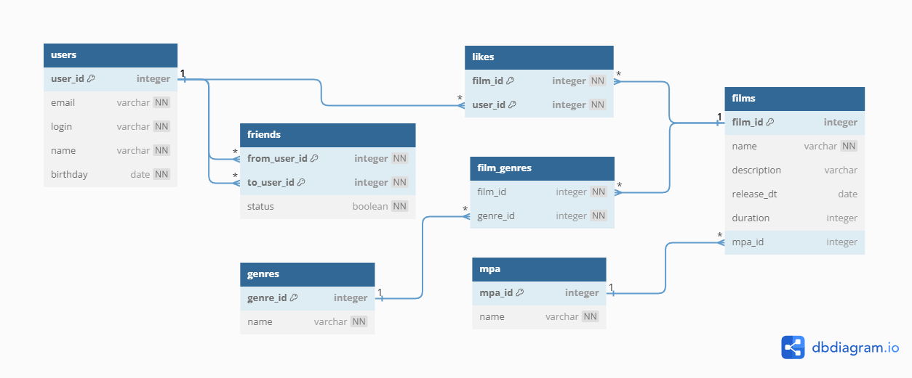

# java-filmorate
Template repository for Filmorate project.


### relationship diagram


### Новая функциональность

В новой версии добавлена следующая функциональность:

**1. Общие фильмы** <br /> 
Реализован вывод общих с другом фильмов, отсортированных по популярности.

```
GET /films/common?userId={userId}&friendId={friendId}
```

**2. Удаление фильмов и пользователей** <br />
Удаление фильма и пользователя по идентификатору.

```
DELETE /users/{userId}
DELETE /films/{filmId}
```

**3.Популярные фильмы** <br />
Возвращение списка самых популярных (по количеству лайков) топ-N фильмов указанного жанра за нужный год.

```
GET /films/popular?count={limit}&genreId={genreId}&year={year}
```

**4.Рекомендации** <br />
Реализована рекомендательная система для фильмов на основе лайков (возвращает список рекомендованных к просмотру фильмов).

```
GET /users/{id}/recommendations
```

**5.Лента событий** <br />
Добавлена возможность просмотра последних событий на платформе — добавление в друзья, удаление из друзей, лайки и отзывы, которые оставили друзья пользователя. 

```
GET /users/{id}/feed
```

**6.Поиск** <br />
Реализован поиск по названию фильмов и по режиссёру. Поиск осуществляется по подстроке. Возможен поиск (i) по режиссеру, (ii) по названию, (iii) одновременно по режиссеру и по названию.

```
GET /films/search?query=yourquery&by=director,title
```

**7.Фильмы по режиссёрам** <br />
В информацию о фильмах должно добавлено имя режиссёра. Также добавлены: 
- Вывод всех фильмов режиссёра, отсортированных по количеству лайков.
- Вывод всех фильмов режиссёра, отсортированных по годам.

```
GET /films/director/{directorId}?sortBy=[year,likes] - Возвращает список фильмов режиссера отсортированных по количеству лайков или году выпуска.

GET /directors - Список всех режиссёров

GET /directors/{id}- Получение режиссёра по id

POST /directors - Создание режиссёра

PUT /directors - Изменение режиссёра

DELETE /directors/{id} - Удаление режиссёра
```

**8.Отзывы** <br />
Добавлены отзывы на фильмы, включающие в себя следующие характеристики:
    1) Оценка — полезно/бесполезно.
    2) Тип отзыва — негативный/положительный.
    3) Рейтинг - У отзыва имеется рейтинг. При создании отзыва рейтинг равен нулю. Если пользователь оценил отзыв как полезный, это увеличивает его рейтинг на 1. Если как бесполезный, то уменьшает на 1.

```
POST /reviews - Добавление нового отзыва.

PUT /reviews - Редактирование уже имеющегося отзыва.

DELETE /reviews/{id} - Удаление уже имеющегося отзыва.

GET /reviews/{id} - Получение отзыва по идентификатору.

GET /reviews?filmId={filmId}&count={count} - Получение всех отзывов по идентификатору фильма, если фильм не указан то все фильмы. Если кол-во не указано то 10.

PUT /reviews/{id}/like/{userId} — пользователь ставит лайк отзыву.

PUT /reviews/{id}/dislike/{userId} — пользователь ставит дизлайк отзыву.
   
DELETE /reviews/{id}/like/{userId} — пользователь удаляет лайк/дизлайк отзыву.

DELETE /reviews/{id}/dislike/{userId} — пользователь удаляет дизлайк отзыву.
```